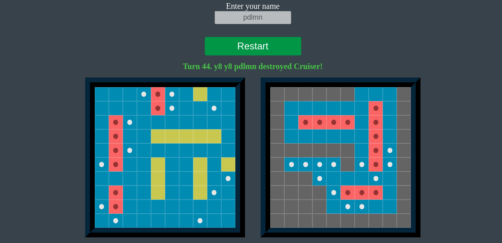
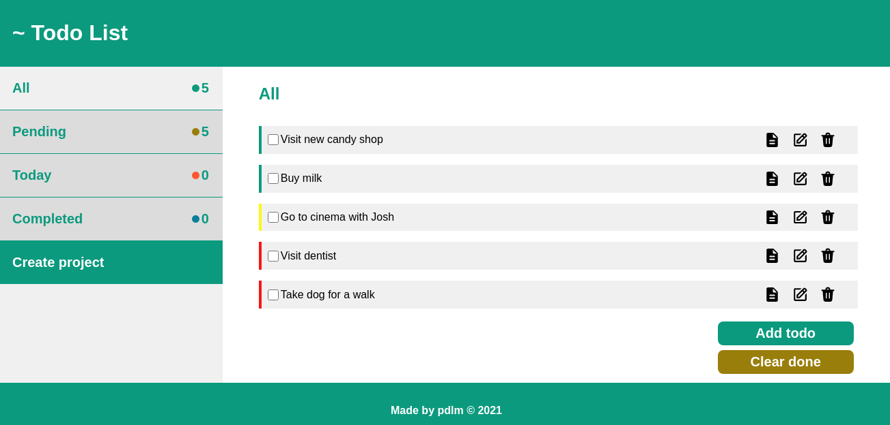
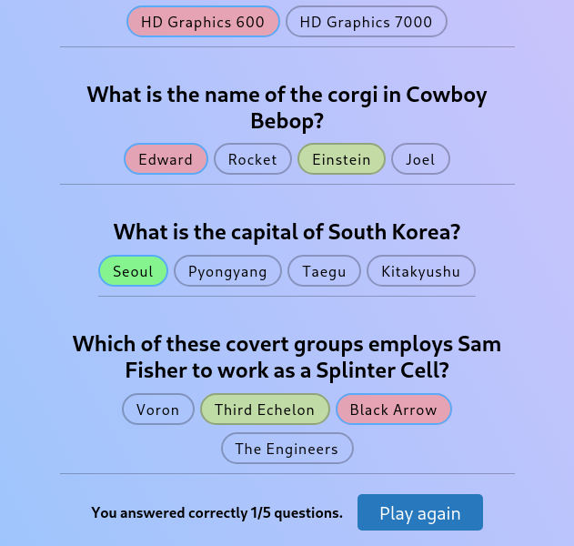

# Muminov Eldar
Aspiring web-developer. 

## Contact

| Email | Discord | GitHub |
| --- | --- | --- |
| jseldardw@gmail.com | pdlmn#0030 | https://github.com/pdlmn |

## About me
Hello! My name is Eldar and I am 26 years old. I started out programming with IT Step Python Development course and fell in love with developing stuff. I enjoy building web apps and learning new things related to programming.

My current goal is to become junior front-end developer, and for this I am using various free recourses and community-driven curriculums like The Odin Project and The Rolling Scopes School. I am self-disciplined and dedicated enough to learning things on my own.

Unfortunately currently I am with my family running from the Russian invasion of Ukraine, so my location isn't definitive. I am still learning to programm when I have an opportunity!

## Skills
Solid understanding of:
- HTML
- CSS
- JavaScript

Had experience with:
- webpack
- React
- jQuery
- Python
- Django
- SQL

Tools:
- Linux (Endeavour OS)
- Neovim
- git/GitHub

## Languages
- English B1-B2
- Ukrainian
- Russian

## Code example
My solution of [this kata](https://www.codewars.com/kata/52efefcbcdf57161d4000091):
```javascript
function count (string) {  
  if (!string) return {}
  return string.split("").reduce((acc, cur) => {
    acc[cur] ? acc[cur]++ : acc[cur] = 1
    return acc
  }, {})
}
```

## Projects

[Battleship](https://github.com/pdlmn/battleship) is the classical game, it features relatively smart AI that is able to defeat the player.


[Todo app](https://pdlmn.github.io/todo-list/) that features tags, priorities, projects and due dates. Todo items are sorted according to their properties. 


[Quizz app](https://pdlmn.github.io/quizzimo/) that tests the knowledge of the player in arbitrary scientific disciplines.
